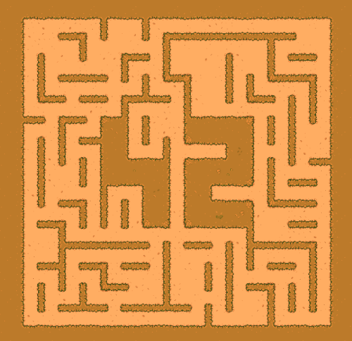
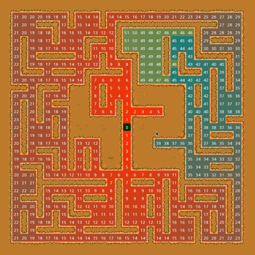
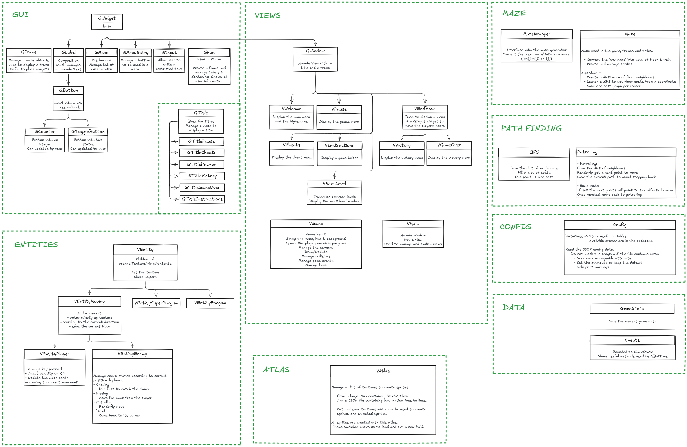

*This project has been created as part of the 42 curriculum by [yguardio](https://external-content.duckduckgo.com/iu/?u=https%3A%2F%2Fwww.dogster.com%2Fwp-content%2Fuploads%2F2024%2F03%2FBelgian-Malinois-e1687773644653.jpeg&f=1&nofb=1&ipt=ca1a3f1c8be458d97acbcc912e6c039bae22087c69654d231ae137c8fa62bff8), [flinguen](https://linguenheld.net/)*

## 42_pacman
Ghosts! More ghosts!


### Description

### Instructions
This project uses [UV](https://docs.astral.sh/uv/) for automatic virtual environment management.
Once installed, you can use it with the Makefile with these commands:

```bash
    make install
    make clean
    make lint
```

Command to launch the game:
(a [configuration file](#Configuration) is mandatory)
```bash
uv run python pac-man.py [CONFIG_FILE]
uv run python pac-man.py --help
```
Or with make which uses the default config file:
```bash
make run
```

### Configuration

It allows you to override default values.
The file as to be a valid JSON.
All invalid values are ignored.
Here the available keys:
```json
{
  "lives": 3,

  "points_per_ghost": 10,
  "points_per_pacgum": 50,
  "points_per_super_pacgum": 200,

  "seed_first_level": 42,
  "amount_of_levels": 10,
  "amount_of_enemies": 4,

  "timer_level": 90.0,
  "timer_enemy_death": 10.0,
  "timer_enemy_fleeing": 10.0,

  "highscore_filename": "test.txt",
  "floor_debug_max_numbers": 10,
  "texture_folder": "textures",

  "height": 1300,
  "width": 1300

  // Comment C
  /* Comment C */
  #  Comment Python
}
```

### Maze Generation

##### Wrapper

Maze generation is done with the [MazeGeneratorWrapper]() class.  
It's an interface between the maze generated by A-Maze-ing package and our Pacman.  

The purpose is to convert an 'Hexa maze' `list[list[int]]` into a 'raw maze' `list[list[int]]`.

```
                  0   1   2   3   4

                ┏━━━┳━━━┳━━━┳━━━┳━━━┓
             0  ┃ 6 ┃ A ┃ 5 ┃ 2 ┃ 8 ┃
                ┣━━━╋━━━╋━━━╋━━━╋━━━┫
             1  ┃ 1 ┃ 2 ┃ 3 ┃ B ┃ C ┃
                ┣━━━╋━━━╋━━━╋━━━╋━━━┫
             2  ┃ 6 ┃ 8 ┃ 9 ┃ A ┃ 2 ┃
                ┗━━━┻━━━┻━━━┻━━━┻━━━┛
```
And:
- Splits all values into nine cases to get the walls with their angles and the floors.
- Set them with 0 or 1 according to the  (0b1111 -> Left|Bottom|Right|Top).

```
        hexa  ->       0       1       2       3       4
         |
         v  raw  0   1   2   3   4   5   6   7   8   9  10

                ┏━━━┳━━━┳━━━┳━━━┳━━━┳━━━┳━━━┳━━━┳━━━┳━━━┳━━━┓
             0  ┃   ┃   ┃   ┃   ┃   ┃   ┃   ┃   ┃   ┃   ┃   ┃
                ┣━━━╋━━━╋━━━╋━━━╋━━━╋━━━╋━━━╋━━━╋━━━╋━━━╋━━━┫
         0   1  ┃   ┃ H ┃   ┃ H ┃   ┃ H ┃   ┃ H ┃   ┃ H ┃   ┃
                ┣━━━╋━━━╋━━━╋━━━╋━━━╋━━━╋━━━╋━━━╋━━━╋━━━╋━━━┫
             2  ┃   ┃   ┃   ┃   ┃   ┃   ┃   ┃   ┃   ┃   ┃   ┃
                ┣━━━╋━━━╋━━━╋━━━╋━━━╋━━━╋━━━╋━━━╋━━━╋━━━╋━━━┫
         1   3  ┃   ┃ H ┃   ┃ H ┃   ┃ H ┃   ┃ H ┃   ┃ H ┃   ┃
                ┣━━━╋━━━╋━━━╋━━━╋━━━╋━━━╋━━━╋━━━╋━━━╋━━━╋━━━┫
             4  ┃   ┃   ┃   ┃   ┃   ┃   ┃   ┃   ┃   ┃   ┃   ┃
                ┣━━━╋━━━╋━━━╋━━━╋━━━╋━━━╋━━━╋━━━╋━━━╋━━━╋━━━┫
         2   5  ┃   ┃ H ┃   ┃ H ┃   ┃ H ┃   ┃ H ┃   ┃ H ┃   ┃
                ┣━━━╋━━━╋━━━╋━━━╋━━━╋━━━╋━━━╋━━━╋━━━╋━━━╋━━━┫
             6  ┃   ┃   ┃   ┃   ┃   ┃   ┃   ┃   ┃   ┃   ┃   ┃
                ┗━━━┻━━━┻━━━┻━━━┻━━━┻━━━┻━━━┻━━━┻━━━┻━━━┻━━━┛
```

Thanks to this raw maze step, we can use mazes for [GFrame]() and [GTitles]() 🐙.

##### Maze

The Maze contains real world coordinates for walls an floors in two sets as well as all geometric properties.  
We only use arcade.Vec2 coordinates.

So it will:
- Create a set of walls and a set of floors.
- Reverse the row/col logic to work in X/Y as Arcade does (all arcades coordinates are from bottom left).
- Convert coordinates to the real arcade world according to the defined SpriteSize.
- Fill sets according to the raw values.

Then thanks to these sets, we can create [SpriteLists]() and display our maze.  
Textures are saved in the [VAtlas]() class and contains entries such as:
- "wall_with_floor_on_top"
- "wall_with_floor_on_top_right"
- ...

By looping in the walls set, we can create sprites according to the current coordinate and its environement.  

<div align="center">
    
</div>

##### Algorithm

The maze manages important dictionaries used by enemies:  
- A [dict of neighbours]() `dict[Vec2, list[Vec2]]`.
   - Each floor entries will contain the list of floors it can access.
   - Thanks to the hashmap, the access of neighbours has a O(1) complexity.
- A [dict of costs]() `dict[Vec2, int]`
   - From a given point, set the cost for each floor to reach the point.
- A [graph corners]() `list[dict[Vec2, int]]`
   - A dict of costs for each corner (used by enemies to go back to their corner).

<div align="center">
    
</div>

The dict of costs is updated each time the player moves into a new floor.  
Enemies just have to move to a lower-cost neighbour to go to the player.  

### General Software Architecture

<div align="center">
    
</div>

### Highscore
Highscores work with a JSON file. The [HighScores]() class allows the program to create and open the file.  
To be JSON proof and simple, the file contains a list of dictionaries which contain two entries:
- name of the player
- its score

When the [VWelcome]() view is created, it simply creates a HighScores object, a str cast will return the list of players in a formated str.  
Checks are performed to avoid incorect entries. They are ignored and won't be used in the save process.  

To save a new entry, [VEndBase](), (which is the mother of [VGameOver]() & [VVictory]()) will use the [process_input]() method.  

It will create a HighScore object and save the new one in this process:  
- Open the file and get the current scores in the format: `list[dict[str, str | int]]`
- Add the new one
- Sort the list by name then by score
- Keep the tenth firsts
- Overwrite the JSON file

### Implementation

If you read that, you're a meticulous examiner.  

### Project Management

To complete our project, we first created a [todo list]() with all required point in the subject.  
Then we affected our tasks, then refactored the code and fill the checkboxes when they were done.  
A more advanced system such a Kanban looked too much for this project.  

### Resources
[UV](https://docs.astral.sh/uv/)  
[Arcade](https://api.arcade.academy/en/stable/index.html)  
[GeeksForGeeks JSON](https://www.geeksforgeeks.org/python/json-with-python/)  
[Excalidraw](https://excalidraw.com/)  

